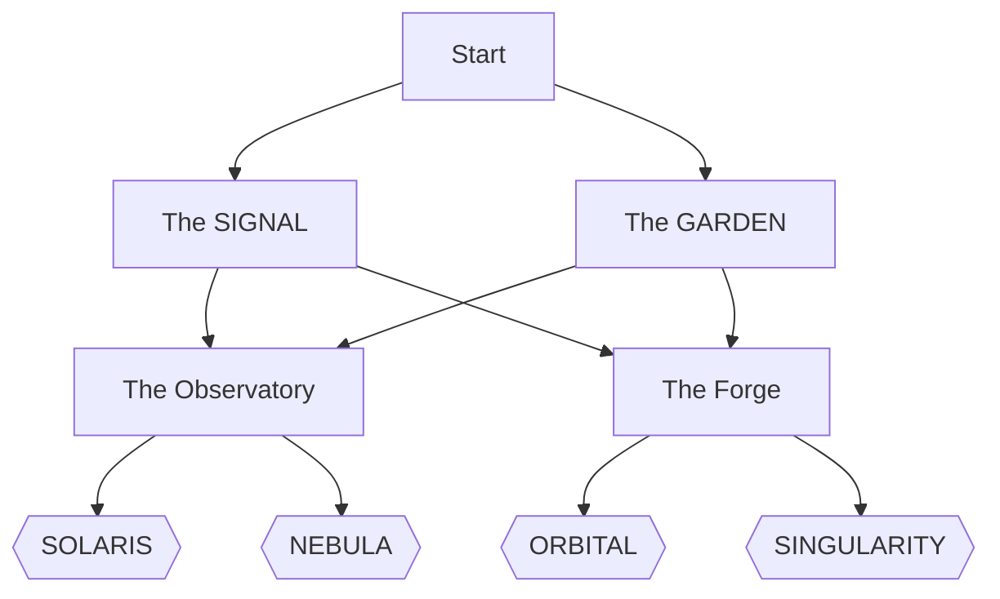

# The Labyrinth of 0xOb5k‑J

Welcome to an experiment: a tiny, interactive, GitHub‑native adventure that lives entirely in a single Markdown file. No JS. No CSS. Just text, links, and a little Mermaid magic.

Badges of the realm:
- 
- 
- 

---

## How to play

- Start your run below and make choices by clicking links.
- Reach an ending to reveal a unique End Code.
- Optional: log your escape by opening a GitHub Issue prefilled with your End Code.

Tip: Everything here is a heading or a link. Use your browser’s back button if you get lost.

---

## Start

You awaken in a neon corridor that hums like a server farm at 3 AM. Two doors glow:

- [Follow the SIGNAL ➜](#the-signal)
- [Enter the GARDEN ➜](#the-garden)

---

## The SIGNAL

Behind the door, a terminal flickers with packet traces and lullaby‑like pings. A prompt waits.

- [TRACE the origin (north) ➜](#the-observatory)
- [JAM the noise (west) ➜](#the-forge)

[⬅ Back to Start](#start)

---

## The GARDEN

You step into a bioluminescent orchard. Vines like circuits, fruit like galaxies.

- [LISTEN to the roots (east) ➜](#the-forge)
- [CLIMB to higher canopy (south) ➜](#the-observatory)

[⬅ Back to Start](#start)

---

## The Observatory

A dome of glass and silence. Above you, constellations arrange themselves into graphs.

- [CALIBRATE the scope to your heartbeat ➜](#ending-solaris)
- [LET THE SKY SPEAK first ➜](#ending-nebula)

[⬅ Back to Start](#start)

---

## The Forge

An anvil of ideas glows white‑hot. Hammers ring with unmet potential.

- [TEMPER patience into the blade ➜](#ending-orbital)
- [STRIKE while the spark is wild ➜](#ending-singularity)

[⬅ Back to Start](#start)

---

## Endings

Pick your path, claim your code.

### Ending: SOLARIS
You tune the stars to your pulse. The cosmos keeps time with you; latency vanishes between thought and light.

End Code: SOLARIS-47E2A9

Log your escape:
- Open Issue: https://github.com/0xOb5k-J/0xOb5k-J.github.io/issues/new?title=I%20escaped%20with%20ENDING%20SOLARIS-47E2A9&body=I%20found%20the%20SOLARIS%20ending%20in%20the%20Labyrinth%20of%200xOb5k%E2%80%91J.%0A%0A%F0%9F%94%97%20End%20Code%3A%20SOLARIS-47E2A9
- Or copy the code into any message you like.

[⬅ Back to choices](#the-observatory) · [⬆ Back to Start](#start)

---

### Ending: NEBULA
You wait. The sky composes itself, then whispers a pattern you couldn’t have forced: elegance by surrender.

End Code: NEBULA-A1D0F5

Log your escape:
- Open Issue: https://github.com/0xOb5k-J/0xOb5k-J.github.io/issues/new?title=I%20escaped%20with%20ENDING%20NEBULA-A1D0F5&body=I%20found%20the%20NEBULA%20ending%20in%20the%20Labyrinth%20of%200xOb5k%E2%80%91J.%0A%0A%F0%9F%94%97%20End%20Code%3A%20NEBULA-A1D0F5

[⬅ Back to choices](#the-observatory) · [⬆ Back to Start](#start)

---

### Ending: ORBITAL
You slow the hammer, letting gravity and rhythm do the work. Orbit found, trajectory true.

End Code: ORBITAL-CC12B4

Log your escape:
- Open Issue: https://github.com/0xOb5k-J/0xOb5k-J.github.io/issues/new?title=I%20escaped%20with%20ENDING%20ORBITAL-CC12B4&body=I%20found%20the%20ORBITAL%20ending%20in%20the%20Labyrinth%20of%200xOb5k%E2%80%91J.%0A%0A%F0%9F%94%97%20End%20Code%3A%20ORBITAL-CC12B4

[⬅ Back to choices](#the-forge) · [⬆ Back to Start](#start)

---

### Ending: SINGULARITY
You strike. Sparks carve a path no map predicted. When the light clears, the walls have learned your name.

End Code: SINGULARITY-9B3C7D

Log your escape:
- Open Issue: https://github.com/0xOb5k-J/0xOb5k-J.github.io/issues/new?title=I%20escaped%20with%20ENDING%20SINGULARITY-9B3C7D&body=I%20found%20the%20SINGULARITY%20ending%20in%20the%20Labyrinth%20of%200xOb5k%E2%80%91J.%0A%0A%F0%9F%94%97%20End%20Code%3A%20SINGULARITY-9B3C7D

[⬅ Back to choices](#the-forge) · [⬆ Back to Start](#start)

---

## Map (Mermaid)

A spoiler‑light map of the Labyrinth’s flow.

---

## Remix this page

- Everything you’ve seen is one Markdown file.
- Want to add a room or another ending? Send a PR that:
  - Adds a new section with a heading.
  - Links to it from an existing choice.
  - Introduces a fresh End Code (format: WORD-HEXHEX).

Optional front matter above lets Jekyll themes set a title/description, but this page works even without it.

---

## Colophon

- Built with plain Markdown, internal anchors, and Mermaid diagrams (rendered by GitHub).
- No scripts. No stylesheets. No frameworks. Just signal.

“Unique is just attention you earned honestly.”
